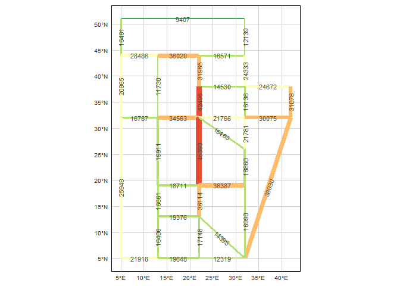

trafficr
================
douglascm
1/2/2020

# Traffic Assignment Package

trafficr is a package for static traffic assignment R code. Currently,
the program can solve the static traffic assignment problem using user
equilibrium (UE) for the city network. The solution is achieved using
the Frank-Wolfe algorithm.

## How to run traffic assignment

Following steps explain the setup and how to run the procedures and
extract flows and maps.

### 1\. Install the R package with:

``` r
devtools::install_github("douglascm/trafficr")
```

Package devtools is required for the installation, install with
`install.packages('devtools')`

### 2\. Data Preparation :

Import into the current environment all three required datasets:

  - *demand* tabular data containing demand data for each origin and
    destination:

<!-- end list -->

``` r
demand <- fread("path to file")
```

    - Required columns:
        - orig: origin id (integer)
        - dest: destination id (integer)

``` r
head(sioux_demand)
#>    orig dest demand
#> 1:    0    1    100
#> 2:    0    2    100
#> 3:    0    3    500
#> 4:    0    4    200
#> 5:    0    5    300
#> 6:    0    6    500
```

  - *network* sf object data containing road network:

<!-- end list -->

``` r
network <- st_read("path to file")
```

    - Required columns:
        - id_link: link id (integer)
        - ffs_fw: forward free flow speed in km/h (numeric)
        - ffs_bw: backward free flow speed in km/h (numeric)
        - cap_fw: forward link capacity in veh/h (numeric)
        - cap_bw: backward link capacity in veh/h (numeric)
    - Optional columns:
        - addv_fw: forward additional cost (numeric)
        - addv_bw: backward additional cost (numeric)
        - wg_fw: forward cost weight (numeric)
        - wg_bw: backward cost weight (numeric)
        - alpha: alpha BPR function parameter (numeric)
        - beta: beta BPR function parameter (numeric)
        - cost: actual network cost, used instead of geometric distance and speed (numeric)

``` r
head(sioux_network)
#> Simple feature collection with 6 features and 12 fields
#> geometry type:  LINESTRING
#> dimension:      XY
#> bbox:           xmin: 5 ymin: 32 xmax: 32 ymax: 51
#> epsg (SRID):    4326
#> proj4string:    +proj=longlat +datum=WGS84 +no_defs
#>   id_link ffs_fw ffs_bw cap_fw cap_bw addv_fw addv_bw wg_fw wg_bw alpha
#> 1       1     60     60  25900  25900       0       0     1     1  0.15
#> 2       2     60     60  23403  23403       0       0     1     1  0.15
#> 3       3     60     60   4958   4958       0       0     1     1  0.15
#> 4       4     60     60  17111  17111       0       0     1     1  0.15
#> 5       5     60     60  23403  23403       0       0     1     1  0.15
#> 6       6     60     60  17783  17783       0       0     1     1  0.15
#>   beta cost                  geometry
#> 1    4    6  LINESTRING (5 51, 32 51)
#> 2    4    4   LINESTRING (5 51, 5 44)
#> 3    4    5 LINESTRING (32 51, 32 44)
#> 4    4    4  LINESTRING (5 44, 13 44)
#> 5    4    4   LINESTRING (5 44, 5 32)
#> 6    4    2 LINESTRING (13 44, 22 44)
```

  - *zones* sf object data containing zones to be added to road network:

<!-- end list -->

``` r
zones <- st_read("path to file")
```

    - Required columns:
        - id_zone: link id (integer)
        - longitude: Longitude in WGS84 (numeric)
        - latitude: Latitude in WGS84 (numeric)

``` r
head(sioux_zones)
#> Simple feature collection with 6 features and 3 fields
#> geometry type:  POINT
#> dimension:      XY
#> bbox:           xmin: 5 ymin: 44 xmax: 32 ymax: 51
#> epsg (SRID):    4326
#> proj4string:    +proj=longlat +datum=WGS84 +no_defs
#>   id_zone  x  y      geometry
#> 1       0  5 51  POINT (5 51)
#> 2       1 32 51 POINT (32 51)
#> 3       2  5 44  POINT (5 44)
#> 4       3 13 44 POINT (13 44)
#> 5       4 22 44 POINT (22 44)
#> 6       5 32 44 POINT (32 44)
```

### 3\. Running the code :

Use the following methods to perform operations:

`configure_graph()` Tranforms network data from source network and zones
and outputs a list with 2 elemens, 1 being the graph and 2 being the
transformed
zones:

``` r
configure_graph(network,zones,turn_penalty,left_side,addvalue_cols,weighted,performance_measures,use_cost_col)
```

  - *network*: sf object containing network data
  - *zones*: sf object containing zone data
  - *turn\_penalty*: Adds turn penalty (see dodgr documentation on turn
    penalty from function ‘R/weight-streetnet.R’)
  - *left\_side*: Does traffic travel on the left side of the road
    (TRUE) or the right side (FALSE)? - only has effect on turn angle
    calculations for edge times. (see dodgr documentation on turn
    penalty from function ‘R/weight-streetnet.R’)
  - *addvalue\_cols*: Does network shapefile has columns ‘addv\_fw’ and
    ‘addv\_bw’ for added cost in links? (TRUE) or (FALSE)
  - *weighted*: Does network shapefile has columns ‘wg\_fw’ and ‘wg\_bw’
    for a cost multiplication factor in links? (TRUE) or (FALSE)
  - *performance\_measures*: Does network shapefile has columns ‘alpha’
    and ‘beta’ for usage on BPR funcion? (TRUE) or (FALSE)
  - *use\_cost\_col*: Use cost column as cost (opposite to speed and
    distance)? (TRUE) or (FALSE)

`configure_demand()` Tranforms demand data from source origin and
destination to match origin and destination from graph/zone objects:

``` r
configure_demand(demand,zones)
```

  - *demand*: demand data
  - *zones*: zones object created with configure\_graph()

`solve_ue()` Solve the traffic flow assignment model (user equilibrium)
by Frank-Wolfe algorithm (all the necessary data must be properly input
into the model in advance).

``` r
solve_ue(graph,demand,col,max_iterations)
```

  - *graph*: Graph object created with configure\_graph() function
  - *demand*: Demand object created with configure\_demand() function
  - *col*: Column from demand file selected for assignment
  - *max\_iterations*: Maximum number of iterations for Frank-Wolfe
    algorithm

Next is an example of the structure to run the entire code, with
additional functions that are documented inside R:

``` r
flist <- configure_graph(sioux_network,sioux_zones,use_cost_col=TRUE)
#> zone data.frame created, graph completed without errors...

graph <- flist[[1]]
zones <- flist[[2]]
demand <- configure_demand(sioux_demand,zones)

graph <- solve_ue(graph,demand,col = 'demand')
#> Number of iterations: 50
#> Time elapsed: 1.97s
times <- get_times(graph,demand)
paths <- get_paths(graph,demand)

network <- graph_to_sf(graph,sioux_network)
plot_flowmap(network,show_labels = T)
#> tmap mode set to plotting
#> Linking to GEOS 3.6.1, GDAL 2.2.3, PROJ 4.9.3
```



## Questions

Feel free to send an email to
[douglas.capelossi@gmail.com](douglas.capelossi@gmail.com) if you have
questions or concerns.

## Future releases

Future releases will have an implementation of other traffic assignment
algorithms such as Gradient Projection, Origin-based assignment, and
Algorithm B.
